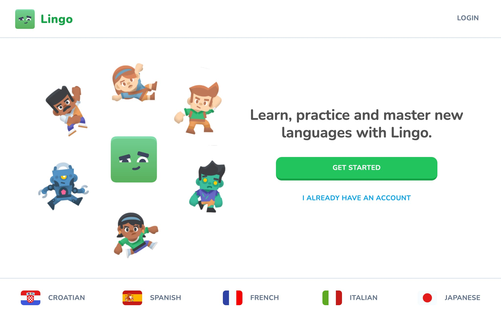

# Lingo

Learn, practice and master new languages with Lingo application.

Complete challenges to gain points and reach the highest position on the leaderboard or practice old lessons to regain hearts. You can also use the shop to become unstoppable learner with unlimited hearts. Have fun and keep exploring! 😊

**[VIEW DEMO](https://nextjs-lingo.vercel.app/)**



---

This is a [Next.js](https://nextjs.org/) project bootstrapped with [`create-next-app`](https://github.com/vercel/next.js/tree/canary/packages/create-next-app) and [`shadcn-ui`](https://ui.shadcn.com/) (default style mode & slate color as base one).

## Key features

- Next.js 14 & server actions
- Component system using [Shadcn UI](https://ui.shadcn.com/)
- Mobile responsiveness
- Auth using [Clerk](https://clerk.com/)
- Sound effects
- Hearts & points system
- Leaderboard
- Quests milestones
- Shop system
- Pro tier for unlimited hearts using [Stripe](https://stripe.com/)
- Admin dashboard (on url path `/admin`) using [React Admin](https://marmelab.com/react-admin/)
- ORM using [DrizzleORM](https://orm.drizzle.team/)
- PostgresDB using [NeonDB](https://console.neon.tech/)

```

To get access to the administrative dashboard change ADMIN_USER_ID environment variable using your user ID from Clerk.

```

## Technology stack

- **Main technologies**:

  - Next.js (app router)
  - Clerk
  - Node.js
  - React
  - TypeScript
  - Tailwind CSS
  - ShadcnUi
  - Drizzle
  - PostgresQL
  - Stripe
  - React Admin

- **Additional dependencies**:

  - Sonner
  - React Use
  - React Confetti
  - React Circular Progressbar
  - Zustand
  - tsx

  ...full list of dependencies is available in `package.json` file.
